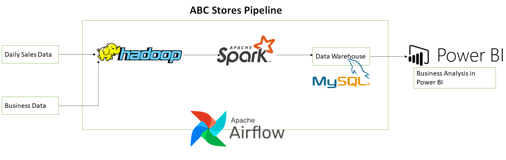
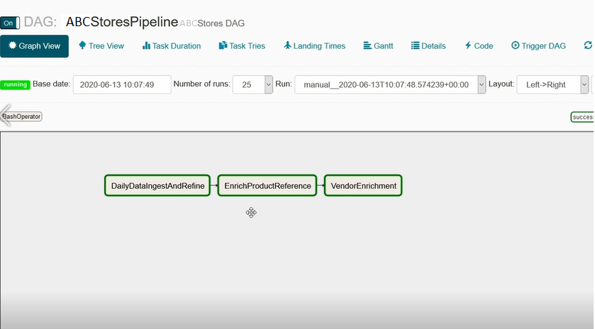
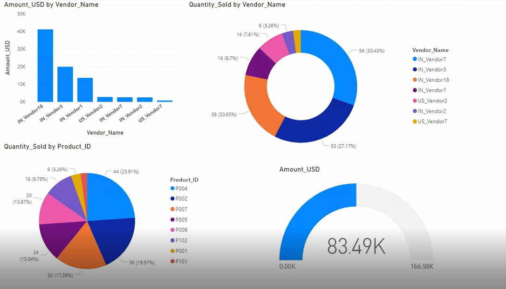

# ABC Stores Pipeline

## Problem Statement
Build an end to end data pipeline for a retail store called ABC-Stores using Hadoop for storage and spark for data processing to produce reports to perform analytics in Power BI. Schedule the pipeline for daily batch data using airflow.

## Business Model
ABC-Stores is a chain of retail stores, serving the customers world-wide, with a wide range of products like groceries, home décor, furniture, electronics, etc.  
ABC-Stores has 4000+ retail stores, selling worldwide and generating the sales data at their POS (Point of Sale) systems on daily basis. From POS systems, data is pushed to a central server, from where the data in ingested in the big data pipeline.   
We need to design a big data pipeline for ABC-Stores for effectively managing huge flow of data and processing as per business requirement and finally deriving a useful business analysis on the data. This huge data will be generated from small POS systems but higher in number. This Data after each and every sale gets stored in an online server from where the data will be pushed in our big data pipeline.
The daily data from the POS systems worldwide, gets pushed into Big-Data pipeline, for cleaning, processing and Business analysis.  
Daily sales data are recieved from POS systems. Business data directly from ABC stores.

##  Business Requirements 

### Columns in Daily Data:
Sale_ID, Product_ID, Quanitity_Sold, Vendor_ID, Sale_Date, Sale_Amount, Sale_Currency

### Conditions:
•	Due to network failure, the columns Quanity_Sold or Vendor_ID might be missing. If the columns are missing, we need to Hold the data till updates received.  
•	Release the hold records in case the updates of the missing values is received in consecutive day’s data. 
•	Sale_Amount – Derive from product price, provided by the Headquarters, considering the Sale Currency’s exchange rate in USD. 
•	Get the vendor details from the business data, and bind with the final extract, for reporting and analysis. 
•	Get the complete sales data, per Sale_ID, to be fetched into the reports.

## Data Pipeline

## Results

### Airflow Dag Runs

### Sample BI report

## Technologies Used
- Hadoop
- Spark
- Scala
- Airflow
- HDP
- mySQL
- PowerBI
